# Gidar AI

Gidar AI is an open-source Flutter AI workspace focused on fast mobile and desktop chat workflows. It brings together multi-provider model access, streaming responses, chat history, code and HTML preview tools, export features, and provider-aware settings in one app.

## Summary

Gidar AI is designed for users who want one place to chat with AI models, switch providers, test prompts, preview generated code or HTML, and keep local conversation history. The app supports a polished settings flow, attachment handling, model management, and export utilities so users can work with different AI backends without juggling multiple apps.

## Main Features

- Multi-provider AI routing with support for OpenRouter, Groq, Gemini, Cerebras, Z.ai, Mistral, SambaNova, and custom OpenAI-compatible providers
- Streaming chat responses with persistent local chat history
- Model picker, provider health checks, and saved provider settings
- Attachment support for images and files
- HTML preview and code sandbox utilities
- PDF export and share flow for chat sessions
- Theme, font, density, and chat appearance customization
- Feedback controls, toast notifications, and mobile-friendly workspace UI

## Tech Stack

- Flutter and Dart
- Riverpod
- GoRouter
- Drift with SQLite
- SharedPreferences and Flutter Secure Storage
- `http` for provider requests
- `flutter_markdown`, `flutter_widget_from_html`, and `webview_flutter`
- `printing` and `pdf`

## Project Structure

- `lib/src/presentation/` UI screens, workspace flows, and reusable components
- `lib/src/domain/` application use cases
- `lib/src/data/` repositories, local storage, and remote data sources
- `lib/src/core/` app models, controller, providers, services, and theme
- `assets/` fonts, logos, and animation assets
- `assets/screenshots/` app screenshots and promo samples
- `test/` widget, repository, and integration-oriented tests

## Screenshots

### Promo Samples

  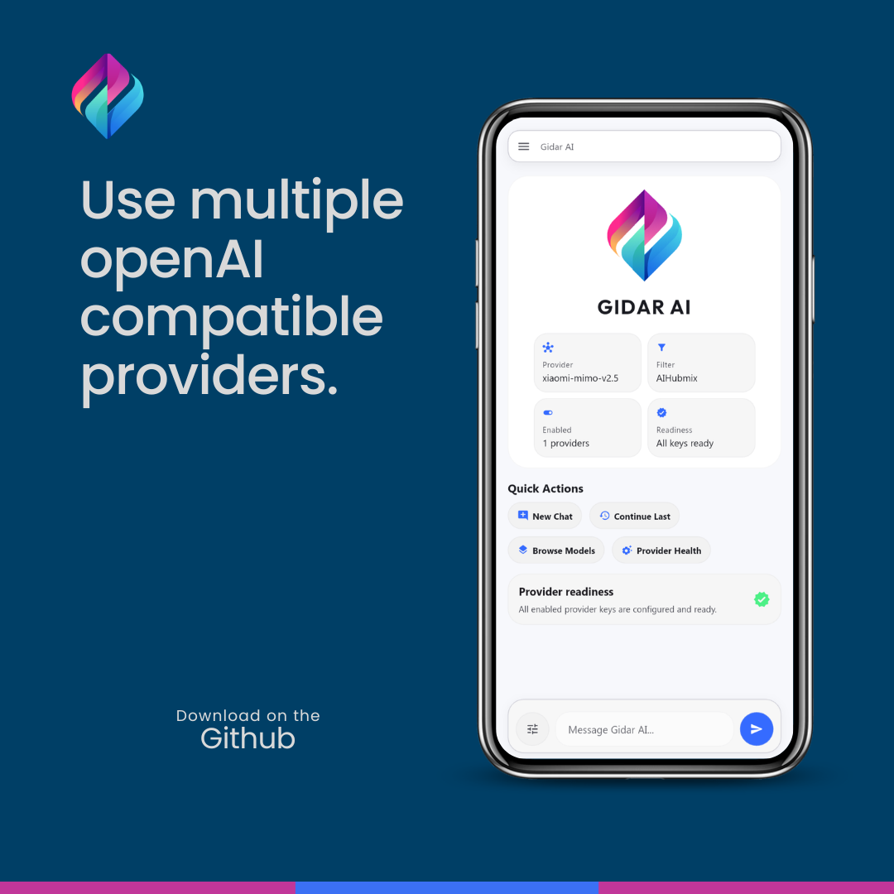
  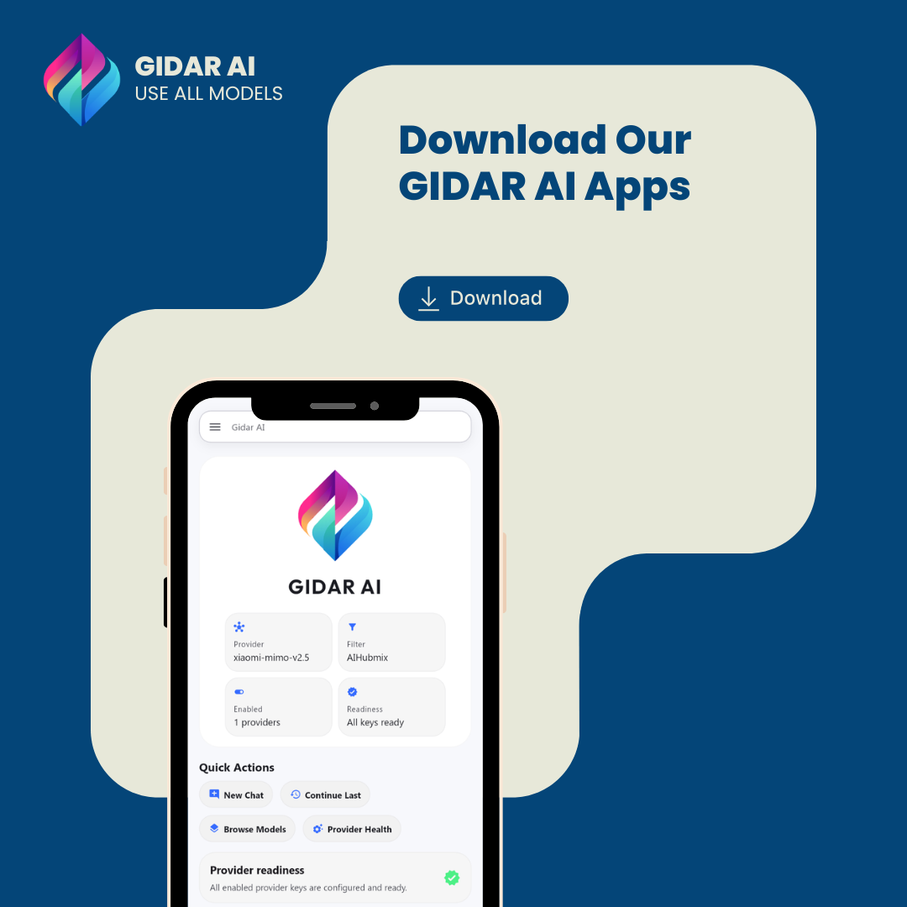

  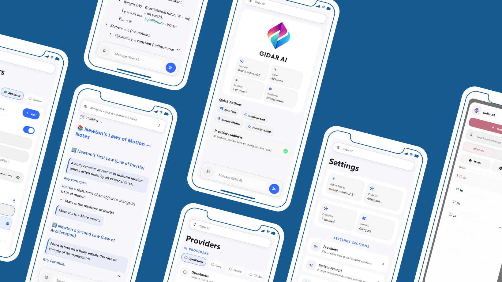

### Story Samples

<table>
  <tr>
    <td align="center">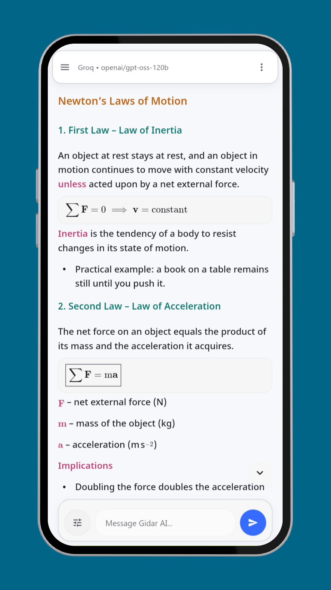 Story 1</td>
    <td align="center">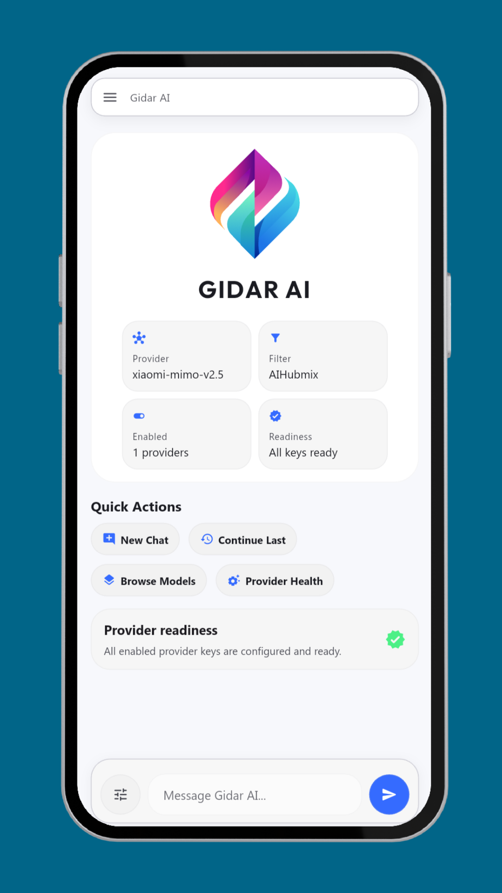 Story 2</td>
    <td align="center">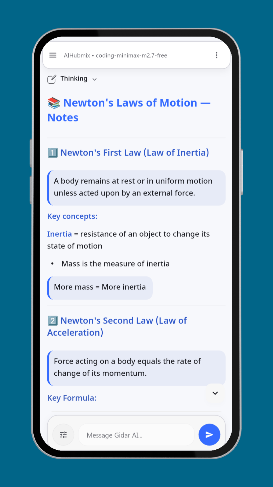 Story 3</td>
    <td align="center">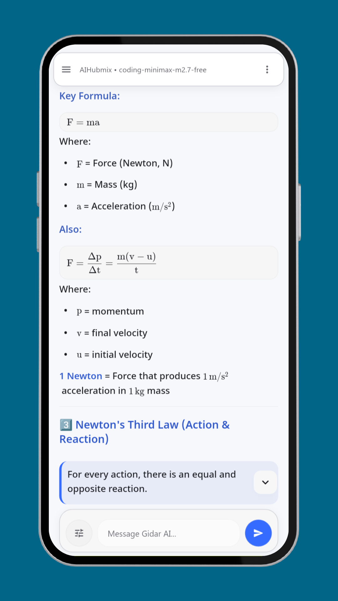 Story 4</td>
    <td align="center">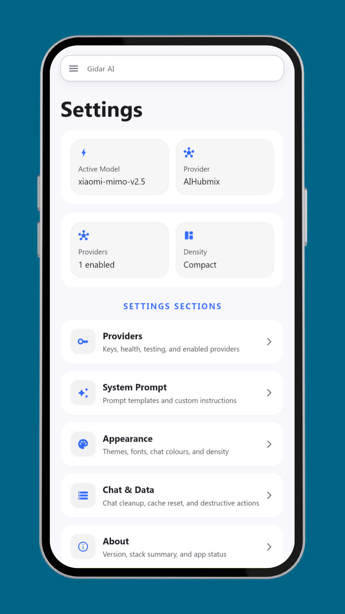 Story 5</td>
  </tr>
  <tr>
    <td align="center">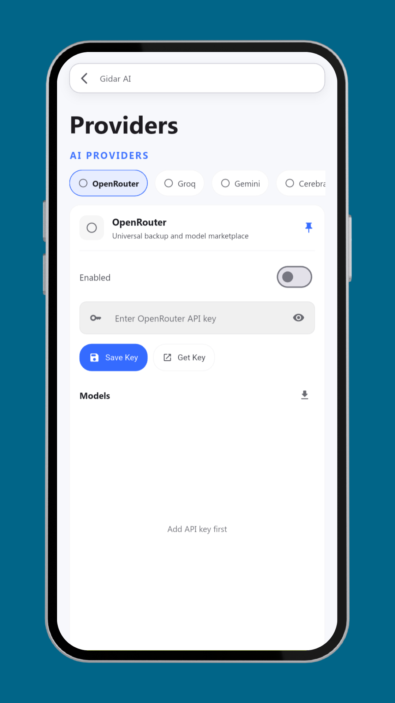 Story 6</td>
    <td align="center">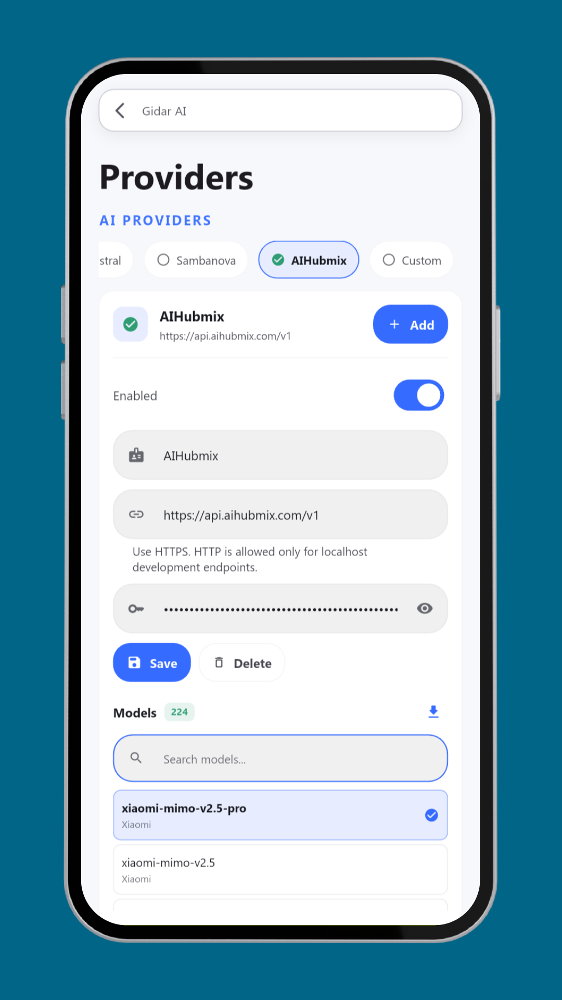 Story 7</td>
    <td align="center">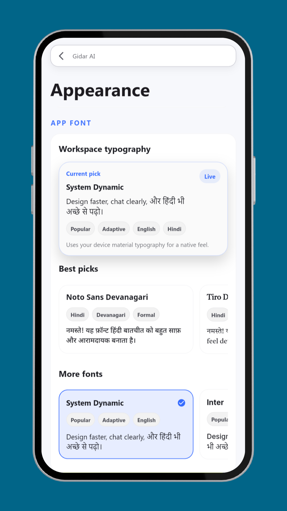 Story 8</td>
    <td align="center">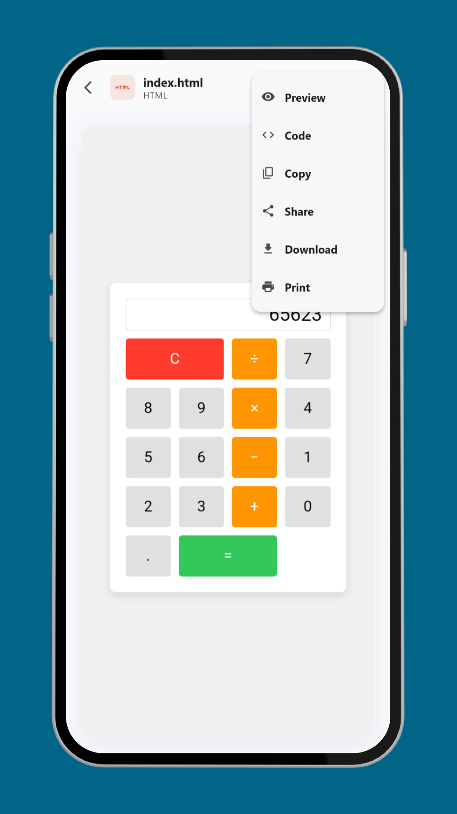 Story 9</td>
    <td align="center">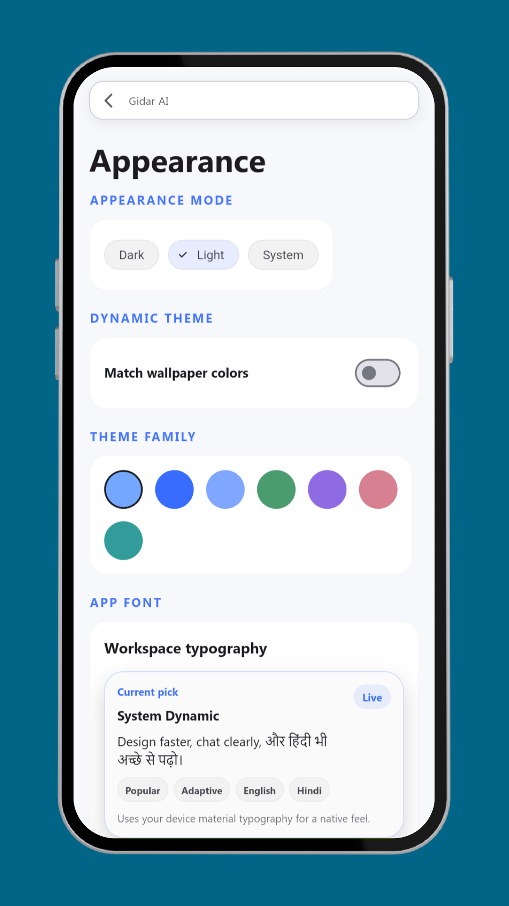 Story 10</td>
  </tr>
</table>

## Setup

1. Install Flutter stable and the Android SDK.
2. Run `flutter pub get`.
3. Start the app with `flutter run -d chrome` or `flutter run -d <deviceId>`.
4. Open `Settings` inside the app.
5. Add one or more provider API keys and choose a model.

## Android Permissions

The Android app currently requests:

- `INTERNET`
- `READ_EXTERNAL_STORAGE` for Android 12 and below
- `READ_MEDIA_IMAGES` for Android 13+
- `CAMERA`
- `WRITE_EXTERNAL_STORAGE` for Android 9 and below

## Open Source And Attribution

This project is released under the Apache License 2.0. You can use, modify, fork, and redistribute it, including in modified versions, as long as you follow the license terms.

Important attribution note:

- Keep the `LICENSE` file
- Keep the `NOTICE` file
- Keep existing copyright and attribution notices
- Clearly mark files you modify when redistributing changes

Project credit:

- Original creator: Kasif
- Feedback and bug reports: `kasifdevloper@gmail.com`

## Feedback And Bug Reports

For feedback, bug reports, support requests, or collaboration, email:

`kasifdevloper@gmail.com`

If you publish a modified version, it is a good idea to document your changes clearly so users can understand what differs from the original project.

## Current Limitations

- Attachment handling is still evolving and not all providers are using full multimodal request payloads yet
- PDF attachment parsing is not complete
- Export formatting is functional but still not final-production polish
- Some advanced markdown and math rendering cases may still need refinement

## Useful Commands

- `flutter pub get`
- `flutter analyze`
- `flutter test`
- `flutter run -d chrome`
